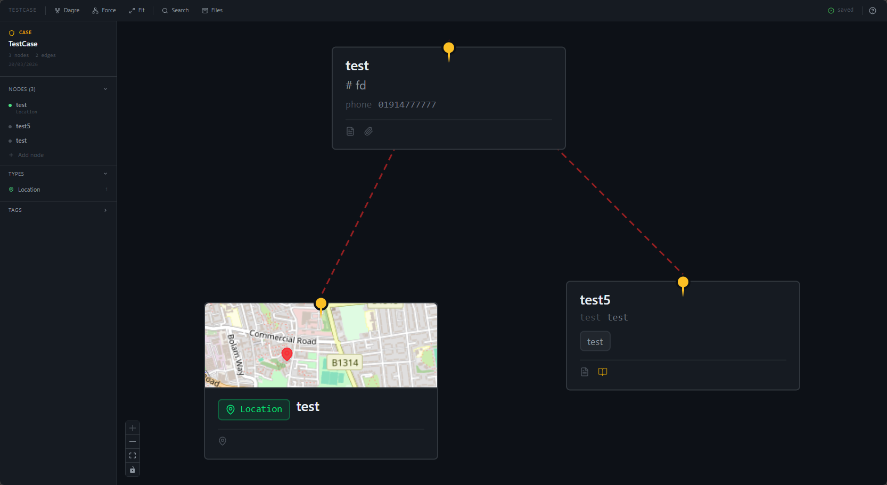

# Caught in the Rain — Companion

A companion app for [_Caught in the Rain_](https://ravensridgeemporium.itch.io/), a solo card-and-dice mystery roleplaying game. It's a spatial case board -- the same freeform graph-of-index-cards board a detective OSINT tool would use -- paired with the game's own mechanics: an investigator sheet, the clue and truth decks (with a genuinely un-peeked 3-card seal), the danger/clock/scene loop, and dice & oracle rollers. Everything lives in a single `.citr` file on your disk. No server. No cloud. No telemetry.

The core idea: you play _Caught in the Rain_ the normal way -- narrating scenes, rolling dice, drawing cards -- and this app tracks all of it for you, while giving you a spatial canvas to lay out the case as you uncover it: suspects, locations, objects, events, and the clue/truth cards themselves, with the connections between them.



---

## Features

- **Graph-based case board** -- freeform canvas with nodes and edges, built on React Flow, with node types for people, organizations, locations, objects, events, documents, clues, truths, and threats
- **`.citr` file format** -- a single zip archive containing your graph, canvas layout, investigator sheet, mystery/deck state, rich content, and attachments
- **Investigator sheet** -- attributes, fatigue track, trait, obligations, and keywords (including a reusable signature keyword)
- **Mystery tracking** -- the problem (location/object/treachery), danger, the 4-scene clock, clue sets, threats & rivals
- **Clue & truth decks** -- a real clue deck (A-10 + jokers) and truth deck (J/Q/K), including 3 cards sealed at mystery creation and never shown in any UI until the Resolve flow's one-shot reveal
- **Scene flow** -- investigation scenes (infiltration/discovery/acquisition/escape stages, attribute tests, consequences, threats), truth scenes, obligation scenes, and rest scenes
- **Dice & oracles** -- raw d6/2d6/D66 rollers, attribute tests, the Yes/No oracle, and a subject oracle (D66 table engine; genre-specific word lists are a planned content pass)
- **Board bridging** -- promote an established clue, a confirmed truth, or a threat straight onto the case board as a node
- **Rich node content** -- every node can have a full BlockNote document (headings, lists, tables, images, code blocks)
- **Freeform + auto layout** -- drag nodes freely, or apply dagre/force-directed auto layout
- **Tag library & full-text search**
- **Offline first** -- runs entirely in the browser, no network requests at runtime
- **File System Access API** -- open and save `.citr` files directly to disk, draw.io style

---

## Getting Started

### Prerequisites

- Node.js 18+
- PNPM

```bash
npm install -g pnpm
```

### Install

```bash
git clone https://github.com/yourname/citr-companion.git
cd citr-companion
pnpm install
```

### Run

```bash
pnpm dev
```

Opens at `http://localhost:5173`.

### Build

```bash
pnpm build
```

Output goes to `dist/`. The build is a fully static bundle -- it can be served from any static host, a local file server, or even a USB stick.

### Preview the build

```bash
pnpm preview
```

---

## The `.citr` Format

A `.citr` file is a ZIP archive. You own the file. It lives wherever you put it.

```
case.citr
├── manifest.json       # case title, version, timestamps
├── graph.json          # all nodes and edges
├── canvas.json         # node positions and viewport state
├── investigator.json   # your investigator's sheet
├── mystery.json        # the problem, danger, clock, clue sets, threats
├── decks.json          # clue/truth deck state, incl. the sealed truth cards (obfuscated)
├── assets/             # images, PDFs, and other attachments
└── content/            # BlockNote documents, one per node
```

You can open a `.citr` with any zip tool if you need to inspect or recover its contents -- though opening `decks.json` will spoil your own mystery. That file is lightly obfuscated (not encrypted) specifically to discourage casual peeking; nothing stops you from decoding it, in the same way nothing physically stops a solo player from looking under the table.

---

## Browser Support

Uses the [File System Access API](https://developer.mozilla.org/en-US/docs/Web/API/File_System_Access_API) for direct file access. This is supported in Chromium-based browsers (Chrome, Edge, Brave, Arc).

Firefox and Safari users get a fallback: open via file picker, save via download. It works, but it's less seamless.

---

## Privacy

- No analytics
- No error reporting
- No network requests at runtime
- Case data never touches `localStorage` or any browser storage -- it lives in the `.citr` file only

You can optionally encrypt the whole `.citr` file with a passphrase (AES-256-GCM via Web Crypto) when you create a case.

---

## Roadmap

- [ ] Real genre D66 tables (Noir/Fantasy/Horror/Sci-fi word lists) for the subject oracle and random tables
- [ ] Career rules: rivals, experience points, progression
- [ ] Multiplayer turn-taking
- [ ] Difficulty / red herrings
- [ ] Timeline / chronological view

---

## Stack

- [React](https://react.dev/) + [Vite](https://vitejs.dev/)
- [React Flow](https://reactflow.dev/) -- canvas and graph rendering
- [BlockNote](https://www.blocknotejs.org/) -- rich text editing
- [Zustand](https://zustand-demo.pmnd.rs/) -- state management
- [JSZip](https://stuk.github.io/jszip/) -- `.citr` archive handling
- [Dagre](https://github.com/dagrejs/dagre) -- hierarchical auto layout
- [Tailwind CSS v4](https://tailwindcss.com/)
- [Lucide](https://lucide.dev/) -- icons

---

## Licence

MIT — _Caught in the Rain_ itself is © Nicholas Robinia / The Ravensridge Emporium; this is an unofficial fan-made companion tool, not affiliated with or endorsed by the publisher.
